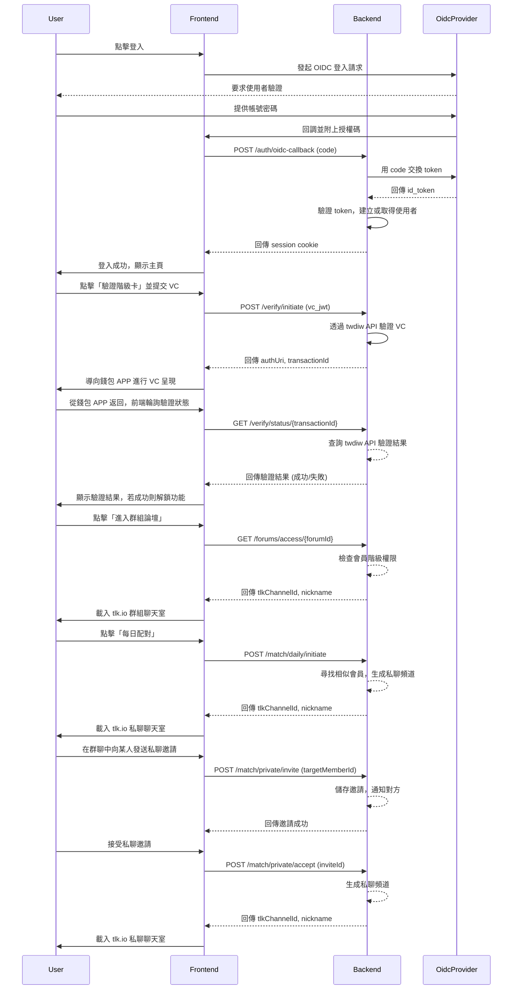

# 三人行必有我師論壇

## 核心理念
本專案旨在建立一個以「階級卡」W3C 可驗證憑證 (Verifiable Credential, VC) 為基礎的社群平台。使用者透過 OIDC 單一登入 (SSO) 後，可選擇性地提供其「階級卡 VC」進行驗證，從而進入專屬的**階級分群論壇**，並獲得**每日配對**的機會，實現更精準、多元的互動。

## 技術棧
- **平台**: Cloudflare Workers
- **框架**: Hono (用於後端 API 與前端服務)
- **前端樣式**: Tailwind CSS
- **核心標準**: 
    - **身份驗證**: OpenID Connect (OIDC)
    - **憑證整合**: `twdiw` API, W3C Verifiable Credentials
- **即時通訊**: `tlk.io` (嵌入式服務)

### 前端演進與參考

本專案前端已從早期的純 HTML/JavaScript 實踐，演進為基於 Hono 框架的現代化架構。

*   **早期 MVP 參考**：若需查閱專案早期的純 HTML/JavaScript MVP 實踐成果，請透過 Git 歷史紀錄追溯 `public/` 資料夾的內容。
*   **當前實踐**：目前前端邏輯與服務由 Hono 框架統一處理，並部署於 Cloudflare Workers。

### 後端開發最佳實踐
根據 Hono 框架與 Cloudflare Workers 的特性，後端開發將遵循以下最佳實踐：

#### Hono 框架通用實踐
- **簡潔的路由處理**：直接在路由定義後編寫函數，以簡化代碼並善用 TypeScript 的型別推斷。
- **模組化**：對於大型應用，使用 `app.route()` 來組織程式碼，將不同功能的路由拆分到不同檔案中。
- **善用中介軟體 (Middleware)**：將通用邏輯（如驗證、日誌）拆分為中介軟體，以保持程式碼的簡潔。
- **資料驗證**：使用 `Zod` 之類的函式庫來驗證傳入的請求內容，確保資料的正確性與安全性。

#### 結合 Cloudflare Workers 的特定實踐
- **無伺服器優先思維**：設計 API 時應使其無狀態、可高度擴展且無冷啟動問題。
- **整合 Cloudflare 邊緣服務**: 
    - **D1 資料庫**：用於需要關聯性資料庫的場景。
    - **KV 儲存**：用於儲存全域設定、功能開關等鍵值對資料。
- **使用 `wrangler` CLI**：作為部署和管理 Workers 的官方命令列工具。
- **管理環境變數與密鑰**：使用 Cloudflare Worker Secrets 來管理敏感資訊。

## 功能藍圖
1.  **OIDC 單一登入與會員註冊**
2.  **VC 驗證與管理**
3.  **階級分群論壇 (Gated Group Chat)**
4.  **每日配對 (Daily Matching)**

---

## 1. OIDC 單一登入與會員註冊

### 註冊流程
使用者將透過外部 OIDC Provider 進行單一登入，流程如下：

1.  **前端觸發**: 使用者在前端點擊「登入/註冊」，被重新導向至 OIDC Provider 的登入頁面。
2.  **OIDC 驗證**: 使用者在 OIDC Provider 完成身份驗證。
3.  **回調與註冊**: 驗證成功後，OIDC Provider 將使用者導回本站，並附上授權碼 (Authorization Code)。
4.  **後端驗證與建立帳戶**: 
    - 後端使用授權碼向 OIDC Provider 交換 ID Token 與 Access Token。
    - 驗證 ID Token 的有效性，並解析出使用者的唯一識別碼 (如 `sub`)。
    - 系統檢查該識別碼是否已存在。若不存在，則為其建立新的會員帳戶（狀態為**一般會員**），並引導使用者填寫**自我宣告**的個人資料（如暱稱、性別、興趣等）。
5.  **綁定 VC (可選)**: 註冊完成後，系統會引導使用者綁定自己的「階級卡 VC」。此步驟為可選，但完成後才能進入專屬聊天室。

## 2. 階級分群論壇 (核心功能)
此功能為「已驗證會員」專屬，旨在建立同溫層內的交流社群。

### 會員等級與權限
| 會員等級 | 條件 | 權限 |
| :--- | :--- | :--- |
| **一般會員** | 僅完成 OIDC 登入與自我宣告。 | 瀏覽公開頁面。 |
| **已驗證會員** | 提交「階級卡 VC」並通過 `twdiw` API 驗證。 | 進入其階級對應的**群組聊天室**、**每日配對**。 |

### 聊天機制
- **聊天室識別**: 後端在驗證使用者的 VC 後，會回傳一個 `matchTicketId`。此 ID 即為 `tlk.io` 的頻道 ID (`tlkChannelId`)，代表一個**群組聊天室**。
- **前端嵌入**: 前端根據後端回傳的 `tlkChannelId` 和使用者暱稱，動態生成 `tlk.io` 的嵌入式 `div` 標籤，從而載入對應的聊天室。
- **存取控制**: 只有成功驗證 VC 並從後端獲得 `matchTicketId` 的使用者，其前端頁面才能正確載入聊天室，從而實現「門控」。

## 3. 每日配對 (Daily Matching)
「每日配對」旨在提供會員更多元、更深入的交流機會，分為兩種形式：

### 配對原則
- **驗證會員優先**：當配對人數不足時，系統將優先為「已驗證會員」進行配對，以確保其交流機會。

### 隨機私聊機會
- **目的**: 每日系統會為「已驗證會員」提供一次與其他相似會員（基於共同興趣、階級等）進行一對一私密聊天的機會。
- **機制**: 系統會生成一個專屬的 `tlk.io` 私聊頻道 ID，有效期限為 24 小時。
- **特點**: 這是探索新連結的機會，配對對象由系統隨機選取，但會考量相似度。

### 群聊轉私聊
- **目的**: 鼓勵會員在群組聊天室中建立更深層的連結，提供從群體互動過渡到一對一交流的途徑。
- **使用者體驗流程**:
    1.  **發送邀請**:
        *   在群組聊天室介面中，使用者可**點擊或將滑鼠懸停在其他成員的暱稱/頭像上**。
        *   彈出一個上下文選單，其中包含「**發送私聊邀請**」選項（僅在雙方皆為「已驗證會員」時顯示）。
        *   點擊後，可有輕量級確認提示，避免誤觸。
    2.  **接收與回應**:
        *   被邀請者會收到**非侵入式**的應用程式內通知（例如 Toast 訊息或通知標記）。
        *   點擊通知後，彈出對話框，提供「**接受**」和「**拒絕**」選項，並簡要說明接受後將開啟私聊。
    3.  **建立私聊**:
        *   一旦被邀請者「接受」，系統立即為雙方生成一個專屬的 `tlk.io` 私聊頻道 ID。
        *   雙方介面**無縫切換**到新的私聊聊天室（可在新分頁、彈出視窗或應用程式內區域）。
        *   私聊介面應清晰標示這是「與 [對方暱稱] 的私聊」。
- **機制**: 需雙方同意才能建立私聊。後端在收到接受請求後，生成專屬的 `tlk.io` 私聊頻道 ID。
- **特點**: 私聊頻道獨立於群組聊天室，提供更私密的交流空間。
- **技術考量**: 由於 `tlk.io` 為嵌入式服務，前端需維護獨立於 `tlk.io` 之外的成員列表以觸發邀請功能。

---

## 4. 系統架構與流程圖

### 資料模型 (ERD) - 簡化版
```mermaid
erDiagram
    "Member Profile" }|..|{ "Forum Post" : "creates"
    "Forum" ||--|{ "Forum Post" : "contains"
    "Member Profile" }|..|{ "Private Chat Session" : "initiates"

    "Member Profile" {
        UUID memberId
        string oidcSubjectId
        enum status
        object selfDeclaredProfile
        string linkedVcDid
        string derivedRank
    }

    "Forum" {
        string forumId
        string requiredRank
        string description
        string tlkChannelId
    }

    "Forum Post" {
        UUID postId
        string forumId
        UUID authorId
        string content
        timestamp createdAt
    }

    "Private Chat Session" {
        UUID sessionId
        UUID memberAId
        UUID memberBId
        string tlkChannelId
        timestamp createdAt
        timestamp expiresAt
        enum type // 'daily_match' or 'group_initiated'
    }
```

### API 序列圖 - 登入與進入聊天室

