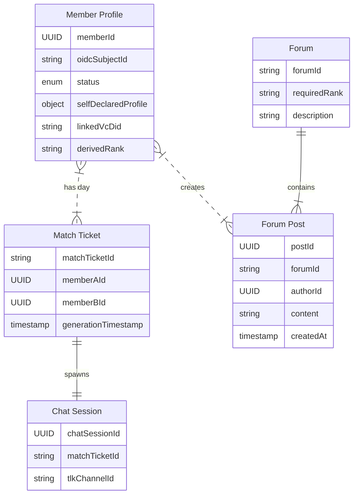
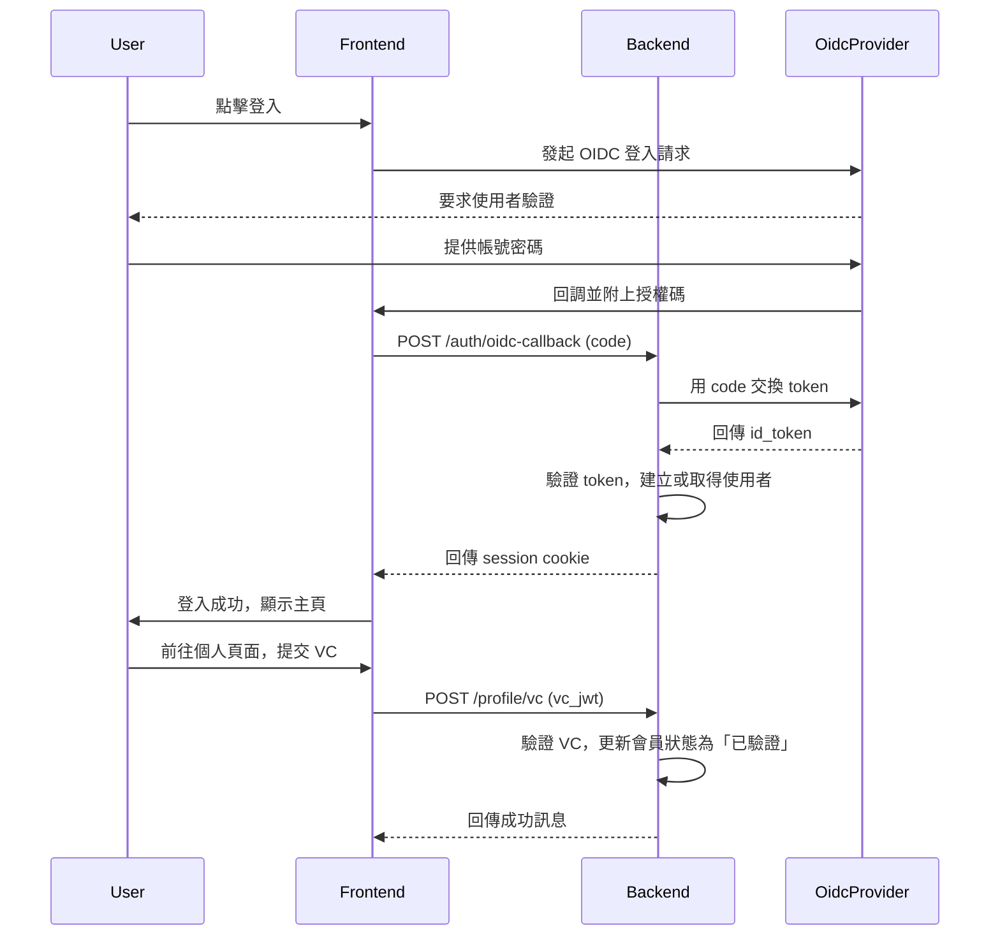

# 三人行必有我師論壇

## 核心理念
本專案旨在建立一個以「階級卡」W3C 可驗證憑證 (Verifiable Credential, VC) 為基礎的社群平台。使用者透過 OIDC 單一登入 (SSO) 註冊後，以**自我宣告**的資訊參與社群。使用者可選擇性地提供「階級卡 VC」，以驗證其社經地位，從而進入專屬的**每日配對**與**分群論壇**，實現更精準、互信的互動。

## 技術棧
- **平台**: Cloudflare Workers
- **後端**: Node.js, TypeScript
- **前端**: Hono (基於 Web 標準的輕量級框架)
- **框架/生態系**: Cloudflare ecosystem (Workers KV, D1)
- **核心標準**: W3C Verifiable Credentials, OpenID Connect (OIDC)

### 後端開發最佳實踐
根據 Hono 框架與 Cloudflare Workers 的特性，後端開發將遵循以下最佳實踐：

#### Hono 框架通用實踐
- **簡潔的路由處理**：直接在路由定義後編寫處理函數，以簡化代碼並善用 TypeScript 的型別推斷。
- **模組化**：對於大型應用，使用 `app.route()` 來組織程式碼，將不同功能的路由拆分到不同檔案中。
- **善用中介軟體 (Middleware)**：將通用邏輯（如驗證、日誌）拆分為中介軟體，以保持程式碼的簡潔。
- **資料驗證**：使用 `Zod` 之類的函式庫來驗證傳入的請求內容，確保資料的正確性與安全性。

#### 結合 Cloudflare Workers 的特定實踐
- **無伺服器優先思維**：設計 API 時應使其無狀態、可高度擴展且無冷啟動問題。
- **整合 Cloudflare 邊緣服務**：
    - **D1 資料庫**：用於需要關聯性資料庫的場景。
    - **KV 儲存**：用於儲存全域設定、功能開關等鍵值對資料。
- **使用 `wrangler` CLI**：作為部署和管理 Workers 的官方命令列工具。
- **管理環境變數與密鑰**：使用 Cloudflare Worker Secrets 來管理敏感資訊。

## 功能藍圖
1.  **OIDC 單一登入與會員註冊**
2.  **每日配對與聊天**
3.  **階級分群論壇**
4.  **VC 驗證與管理**

---

## 1. OIDC 單一登入與會員註冊

### 註冊流程
使用者將透過外部 OIDC Provider 進行單一登入，流程如下：

1.  **前端觸發**: 使用者在前端點擊「登入/註冊」，被重新導向至 OIDC Provider 的登入頁面。
2.  **OIDC 驗證**: 使用者在 OIDC Provider 完成身份驗證。
3.  **回調與註冊**: 驗證成功後，OIDC Provider 將使用者導回本站，並附上授權碼 (Authorization Code)。
4.  **後端驗證與建立帳戶**:
    - 後端使用授權碼向 OIDC Provider 交換 ID Token 與 Access Token。
    - 驗證 ID Token 的有效性，並解析出使用者的唯一識別碼 (如 `sub`)。
    - 系統檢查該識別碼是否已存在。若不存在，則為其建立新的會員帳戶，並引導使用者填寫**自我宣告**的個人資料（如暱稱、興趣、年齡等）。
5.  **綁定 VC (可選)**: 註冊完成後，系統會引導使用者綁定自己的「階級卡 VC」。此步驟為可選，但完成後才能使用進階功能。

## 2. 每日配對與聊天

核心價值在於提供基於「階級卡 VC」的安全、私密的每日配對體驗。

### 會員等級與資訊揭露
系統簡化為兩種會員等級，核心差異在於是否提供 VC。

| 會員等級 | 提供的資訊 | 每日配對權重 | 可用功能 |
| :--- | :--- | :--- | :--- |
| **一般會員** | **自我宣告**的基本資訊 (如性別、年齡、興趣)。 | 較低 | 每日配對 |
| **已驗證會員** | **可驗證的**階級卡 VC (`doc/vc-asset-player-rank.md`)。 | 較高 | 每日配對、階級分群論壇 |

- **自我宣告**: 所有使用者註冊後即為「一般會員」，使用自行填寫的資訊進行配對。此舉降低了使用門檻，讓使用者可以先體驗核心功能。
- **升級為已驗證會員**: 使用者可以隨時在個人資料頁面提交自己的「階級卡 VC」。後端驗證 VC 的簽章與內容後，該會員狀態即升級為「已驗證會員」，獲得更高的配對權重並解鎖所有功能。

### 配對演算法
`Score = f(年齡距離, 興趣交集, 階級等級相近度, 會員等級權重)`

- **階級等級相近度**: 僅在雙方均為「已驗證會員」時計算。
- **會員等級權重**: 「已驗證會員」會獲得顯著高於「一般會員」的權重，以鼓勵使用者提供 VC，建立更可信的交流環境。

### 聊天機制
每日配對成功後，雙方可開啟一次性的 `tlk.io` 聊天室，時限 24 小時。聊天流程與安全機制與前期設計相同。

## 3. 階級分群論壇
此功能為「已驗證會員」專屬，旨在建立同溫層內的交流社群。

### 功能說明
- **論壇區隔**: 系統會根據「階級卡 VC」中的階級（如 `Sapphire Elite`）自動生成專屬的論壇版面。
- **存取控制**: 只有持有對應階級 VC 的「已驗證會員」才能瀏覽和參與該版面的討論。例如，持有 `Sapphire Elite` VC 的使用者才能進入「Sapphire Elite 討論區」。
- **目的**: 讓背景相似的會員有一個私密的交流空間，可以討論共同話題、分享經驗，從而提高社群黏著度。

---

## 4. 系統架構與流程圖

### 資料模型 (ERD) - 簡化版

### API 序列圖 - 登入與 VC 綁定

