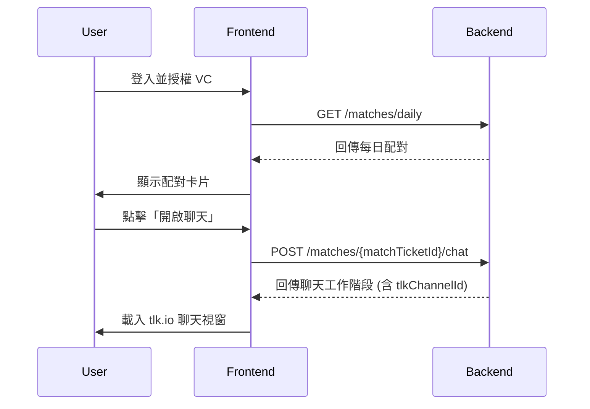

# 服務：聯誼網站
原則上不動產、動產會製作成單一憑證，以實現可以局部揭露並維持資料新鮮。

## 證明電子檔，含數位簽章驗證
配合單一登入流程（詳見 `doc/單一登入.md`），會員授權 W3C VC 後即可進入各項服務。

## 財富排行榜
- 來源：`doc/vc-asset-player-rank.md`, `doc/vc-credit-liability.md`, `doc/vc-liquid-finance.md`, `doc/vc-personal-property.md`, `doc/vc-real-estate-asset.md`
- 目的：以最少欄位揭露建立可比較的資產/負債概況。
- KC：僅儲存 VC 摘要，原始 VC 仍由錢包保存。

## 每日配對，聊天

本服務的核心價值在於提供一個基於可驗證憑證 (VC) 的安全、私密的每日配對體驗。會員可以自主選擇每日願意揭露的資產或負債證明，系統將依此計算配對分數，並提供一次性的聊天機會，創造每日的新鮮感與期待感。

**Hackathon 範圍**: 目前版本專注於核心的配對與聊天流程，部分進階功能如即時 VC 驗證、自動化內容審查及站內訊息備援將在後續版本中補強，詳見 `Hackathon Shortcuts` 說明。

參考 `doc/串接聊天設計.md`（tlk.io 嵌入）。以下為黑客松版本展示內容。

### 可信資料來源
本服務的所有配對皆基於 W3C 可驗證憑證 (Verifiable Credentials, VC)，確保資料的真實性與使用者自主控制。會員必須授權提供如年齡、財務狀況等相關的 VC，才能進入配對池。詳細的憑證發行規範請參考 `doc/VC_service.json`。

### 每日節奏與通知
為了維持服務的新鮮感並鼓勵每日互動，我們設計了以下的每日節奏：

1.  **00:00 - 重置與準備**: 系統於每日零點重置所有會員的配對狀態，並提醒會員可以為新的一天選擇想要揭露的憑證。會員可選擇沿用前一天的設定，或從建議的組合中快速挑選。
2.  **11:30 - 每日提醒**: 系統會透過您偏好的通知渠道 (如 Email、手機推播) 發送「今日揭露」提醒，確保您不會錯過參與配對的機會。
3.  **12:00 - 生成配對**: 系統會根據您的偏好與當日授權的 VC，為您計算並生成一組當日最佳配對。配對結果將以「配對卡片」的形式呈現，有效期限為 24 小時。
4.  **開啟聊天**: 在配對卡片的有效時間內，您隨時可以點擊卡片，在再次確認授權後，即可進入專屬的 tlk.io 聊天室，與您的配對對象互動。

### 配對卡片
每日配對成功後，您將會收到一張電子配對卡片，卡片上會以摘要形式顯示對方已授權的 VC 資訊。

**卡片內容範例:**
```
┌────────────────────────────┐
│ 等級：Sapphire Elite        │
│ VC：vc_asset_player_rank_certificate
│ IAL：3   有效：2025/11/25
│ 摘要：rank = "Sapphire Elite"
└────────────────────────────┘
```

-   **資訊來源**: 卡片上的資訊來自您與對方當日所授權的 VC，例如 `doc/vc-asset-player-rank.md`。
-   **動態樣式**: 卡片的背景顏色會根據對方的階級等級而變化，讓您能快速識別。
-   **詳細資訊**: 您可以點擊卡片上的「查看 VC 詳細欄位」按鈕，來檢視該張 VC 的完整內容。

### 自選揭露等級
您可以自主決定每日願意揭露的資訊等級，這將直接影響您的配對品質與對象。

| 揭露等級 | 提供的資訊 | 可見的配對資訊 |
| :--- | :--- | :--- |
| **Minimal** | **自我宣告**的基本資訊 (如性別、年齡、興趣)，用於配對。**不提供**任何 VC。 | 對方同意揭露的基本資訊 (如暱稱) |
| **Basic** | **可驗證的**階級卡 VC (`doc/vc-asset-player-rank.md`) | 對方的階級 |
| **Standard** | **Basic 所有項目**<br>+ **可驗證的**信用負債 (`doc/vc-credit-liability.md`)<br>+ **可驗證的**流動金融資產 (`doc/vc-liquid-finance.md`) | 對方的負債狀況、流動資產摘要 |
| **Premium** | **Standard 所有項目**<br>+ **可驗證的**動產 (`doc/vc-personal-property.md`)<br>+ **可驗證的**不動產 (`doc/vc-real-estate-asset.md`) | 對方的動產、不動產狀況 |

為了減輕您的每日設定負擔，系統提供「沿用昨日揭露」以及建議的揭露組合按鈕。

### 配對演算法
我們的配對演算法旨在為您找到最合適的對象，同時確保過程的公平與透明。

**計分公式**:
`Score = f(年齡距離, 興趣交集, 財富等級相近度, 揭露層級權重)`

-   **年齡距離**: 您偏好的年齡範圍與對方年齡的差距，差距越小分數越高。此參數基於雙方在偏好中設定的期望值。
-   **興趣交集**: 雙方共同興趣的數量，交集越多分數越高。此參數基於雙方在偏好中設定的興趣標籤。
-   **財富等級相近度**: 雙方財富等級的相似度，我們鼓勵在相似的基礎上進行交流。此項僅在雙方都提供相關 VC (Basic 等級以上) 時計算。
-   **揭露層級權重**: 您選擇的揭露等級 (Minimal, Basic, Standard, Premium) 會給予不同的權重。越高的等級代表越高的參與意願與可信度，將有助於提升配對分數。

**`Minimal` 等級配對說明**:
當您選擇 `Minimal` 等級時，您需要**自我宣告**您的基本資訊 (如年齡、性別、興趣) 以作為配對依據。系統將使用這些您提供的非驗證資訊，與其他會員的偏好進行比對。由於未提供可驗證的個人資訊 (VC)，您在他人配對結果中的權重會較低。

**公平性限制**:
為了避免單一會員長時間無法獲得配對，或重複與同類型的對象配對，系統設有公平性限制。我們會監控並調整配對的覆蓋範圍，確保所有會員都有公平的機會。

**結果**:
每日系統會為您計算所有潛在對象的分數，並從中挑選出得分最高的一組，作為您的當日配對。

### 聊天啟動與安全聲明
當您準備好與配對對象互動時，可以透過配對卡片上的「開啟聊天」按鈕來啟動聊天。

**聊天入口**:
-   本服務使用 `tlk.io` 作為第三方聊天平台，聊天將在一個內嵌的視窗中進行。
-   點擊按鈕後，系統會引導您完成最後的授權，確認您願意分享的個人資訊 (如暱稱)。您隨時可以撤銷您的分享授權，撤銷後，對方將無法再看到您的資訊，聊天連線也將中斷。詳細的技術實作請參考 `doc/串接聊天設計.md`。

### 安全與舉報
我們致力於維護一個友善、安全的社群環境。

**舉報流程**:
如果您在聊天過程中遇到任何不當言論或騷擾行為，請使用聊天視窗中的「舉報」按鈕。提交舉報時，請盡可能提供詳細的對話紀錄或截圖，這將有助於我們的營運團隊進行調查。

**Hackathon 期間的審查缺口**:
-   **無即時審查**: 目前的 Hackathon 版本不包含聊天內容的自動化或人工即時審查機制。
-   **手動處理**: 所有舉報將由營運團隊在收到後 24 小時內進行手動審查與處理。
-   **後續計畫**: 我們將在正式版本中導入 AI 輔助的敏感詞偵測與即時警示功能，以提升社群安全。

### 啟動聊天工作階段 (API)
當使用者點擊「開啟聊天」並完成授權後，前端應用程式會呼叫 `POST /matches/{matchTicketId}/chat` API 來建立一個聊天工作階段。

-   **matchTicketId**: 此 ID 來自使用者當前的配對卡片。
-   **Request Body**: 請求中會包含一個 `consentToken`，證明使用者已同意分享資訊。
-   **Response**: 成功後，API 會回傳聊天工作階段的詳細資訊，包括 `tlkChannelId`，前端將使用此 ID 來載入 `tlk.io` 的內嵌聊天視窗。

這個流程確保了只有在使用者明確授權後，才能啟動聊天，保障了使用者的隱私與控制權。

### 營運指標與稽核
為了確保服務的健康發展與公平性，營運團隊將持續追蹤以下關鍵績效指標 (KPI)：

**公平性指標**:
-   **性別平衡**: 監控每日配對中的性別比例，確保不會出現系統性偏好。
-   **地區平衡**: 追蹤不同地區會員的配對成功率，避免因地區差異導致的配對困難。
-   **揭露層級覆蓋率**: 分析不同揭露層級 (Minimal, Standard, Premium) 的會員分佈與配對機會，確保各層級會員都能獲得合理的對待。

**服務健康度指標**:
-   **每日配對成功率**: 成功生成配對的會員數 / 進入配對池的總會員數。
-   **聊天啟動率**: 成功開啟聊天的配對數 / 每日總配對數。
-   **SSO 例外數量**: 記錄因單一登入失敗而無法參與配對的使用者數量。

**稽核流程**:
-   **稽核週期**: 營運團隊將每季對配對演算法的公平性指標進行審查，並產出報告。
-   **聊天紀錄保留**: **[修正]** 根據 `tlk.io` 的服務條款，免費頻道的聊天紀錄僅保留 **10 分鐘**。為了滿足未來可能的合規需求，我們已將「建立聊天紀錄備份機制」列為 Hackathon 後的優先改善項目 (詳見 `Hackathon Shortcuts` 段落)。在目前版本中，若需保留證據，建議使用者手動截圖。
-   **證據調閱**: 在現行 `tlk.io` 的限制下，僅能調閱 10 分鐘內的對話。若發生使用者舉報，營運團隊將盡力在時限內介入並保存證據。

### 例外與變更管理
在特定情況下 (例如行銷活動、新功能測試)，若需要暫時放寬服務的既有規則 (如配對資格、揭露等級)，必須遵循以下的例外與變更管理流程：

1.  **提交申請**: 需求方需提交一份「變更申請單 (Variance Request)」，詳述變更範圍、理由、預計影響與風險評估。
2.  **審核與批准**: 申請單將由合規、產品與資安團隊共同審核。所有批准的變更都將被記錄在案，包含責任人與有效期限。
3.  **公告與監控**: 所有生效中的變更將對內部相關人員公告。營運團隊將在變更期間密切監控相關指標，確保風險可控。

### 資料模型 (ERD)
```mermaid
erDiagram
    "Member Profile" }|..|{ "Match Ticket" : "has"
    "Match Ticket" ||--|| "Chat Session" : "spawns"
    "Compliance Event" ..> "Match Ticket" : "consumes"
    "Compliance Event" ..> "Chat Session" : "consumes"
    "Variance Record" ..> "Member Profile" : "references"
    "Variance Record" ..> "Chat Session" : "references"

    "Member Profile" {
        UUID memberId
        string did
        enum kycStatus
        map vcSnapshots
        object preferenceConfig
        enum consentStatus
    }

    "Match Ticket" {
        string matchTicketId
        UUID memberAId
        UUID memberBId
        timestamp generationTimestamp
        object criteriaSnapshot
        enum status
        timestamp expiry
        string vcValidationResult
        list notifications
    }

    "Chat Session" {
        UUID chatSessionId
        string matchTicketId
        string tlkChannelId
        list participants
        string contentRetention
        list moderationEvents
        enum status
    }

    "Compliance Event" {
        UUID eventId
        enum eventType
        string sourceRef
        string actor
        timestamp timestamp
        string evidenceLocation
        enum outcome
    }

    "Variance Record" {
        UUID varianceId
        string scope
        string justification
        string approver
        date effectiveDate
        date expiryDate
        string mitigationPlan
        enum status
    }
```

### API 序列圖


### Hackathon Shortcuts
為了在有限的時間內完成核心功能展示，本次 Hackathon 版本採取了一些簡化措施。這些被延遲的工作 (deferred work) 將在未來的版本中陸續補強。

| 延遲項目 | 簡化措施 (目前作法) | 負責人 (Owner) | 預計完成日期 |
| :--- | :--- | :--- | :--- |
| **即時 VC 驗證** | 每日批次重新驗證 | Security Lead | 2025-11-15 |
| **聊天內容審查** | 無自動化審查，僅靠手動舉報 | Operations Lead | 2025-11-10 |
| **自動化備份/恢復** | 人工手動備份 | Infrastructure Lead | 2025-11-12 |

### 服務可用性與備援
-   **服務等級目標 (RPO/RTO)**: 本服務的目標是達到 RPO (Recovery Point Objective) ≤ 4 小時，以及 RTO (Recovery Time Objective) ≤ 1 小時。
-   **備援機制 (Fallback)**: 若發生後端配對服務或 `tlk.io` 聊天服務中斷，系統將暫停新的配對與聊天功能，並在頁面上顯示服務中斷的公告，引導使用者稍後再試。在 Hackathon 版本中，所有備援程序將以手動方式執行。
